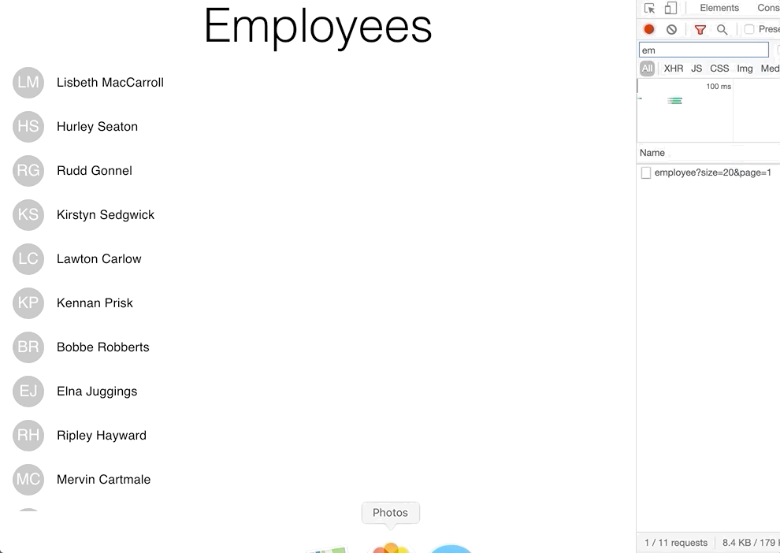

Load data progressively as user scrolls down with minimal coding. 
Skip to the [The Front End section](#the-front-end--react-app) if you already have a backend available. 
Both backend and front end code is available on [GitHub](https://github.com/sumedh22/react-load-more-on-scroll/).



## The Backend
For this demo we need a backend which is capable of handling paging controls. we are using spring boot with the following dependencies:
- **spring-boot-starter-data-rest** : Exposes repositories as Rest Endpoints
- **spring-boot-starter-data-jpa** : For creating repositories
- **h2** : embedded database for quick start

### Configuring Entity

For the demo we are using a standard Employee entity

```java

@Entity
 class Employee {

   @Id
   @GeneratedValue(strategy = GenerationType.AUTO)
   private long id;
   private String firstName;
   private String lastName;
   private String gender;
   private String ipAddress;
   private String email;
... getters and setters
}
```


### Configuring Rest Repository

Extending the PagingAndSortingRepository to expose the Employee entity.

```java
@RepositoryRestResource(collectionResourceRel = "employee", path = "employee")
 interface EmployeeRepository extends PagingAndSortingRepository<Employee, Long> {
   List<Employee> findByFirstName(@Param("firstName") String name);
}
```

### Configuring CORS

Extending *RepositoryRestConfigurer* and overriding *configureRepositoryRestConfiguration* method to configure cross origin domains.

```java
@Configuration
 class ConfigRepositoryRest implements RepositoryRestConfigurer {
   @Override
   public void configureRepositoryRestConfiguration(RepositoryRestConfiguration config) {
      config.getCorsRegistry()
            .addMapping("/**")
            .allowedOrigins("http://localhost:3000");
   }
}
```

## The Front End : React App

For pagination support we are using [react-hook-pagination](https://www.npmjs.com/package/react-hook-pagination) library and for UI elements we are using [@material-ui/core](https://www.npmjs.com/package/@material-ui/core)

### Simple list — without pagination

We are using material components to create a list. The list data is stored as one of the state property of the component and for iterating over the data we are using For component.

```jsx
<List ref={scroller}>
<For data={data} itemRenderer={(emp, idx) => (
  <ListItem key={idx} button>
  <ListItemIcon>
    <Avatar>{getInitials(emp.firstName, emp.lastName)}</Avatar>
  </ListItemIcon>
  <ListItemText primary={`${emp.firstName} ${emp.lastName}`}>     </ListItemText>
</ListItem>)}
></For>
</List>
```

Defining the data, initialising with empty array.

```js
const [data, setData] = useState([]);
```

### list — with pagination

In order to add pagination to the above list we need to import the below libs:

```js
import React, { useRef, useState, useEffect } from "react";
import useLoadMoreOnScroll from "react-hook-pagination";
```

Initialising **useLoadMoreOnScroll** involves specifying 3 params: *fetchSize*: size of each chunk of data as we fetch progressively , *scroller*: the scroll container whose scroll position will be monitored , *limit*: max. items to be displayed in the list.

```js
const scroller = useRef();
const {
  start,
  end,
  isFetching,
  doneFetching,
  setIsFetching,
  forceDonefetching
} = useLoadMoreOnScroll({ fetchSize: 20, scroller: scroller, limit: 1000 });
```

The useLoadMoreOnScroll hook returns the start , end etc letting the component know when it should fetch the next batch. Boolean attributes like isFetching, doneFetching can be used to display messages or loaders. The scroller in our demo is the List itself.

```jsx
<List ref={scroller}>
...
</List>
```

Based on the scroll position the hook will update the new set of start and end indices and our component and react to that effect by fetching the new batch of data. This could be implemented by using the react useEffect hook.

```js
useEffect(() => {
  if (start !== end) {
  setIsFetching(true);
  fetchEmployees(start, end).then(employees => {
    setData([...data, ...employees]);
    setIsFetching(false);
  });
}
}, [start, end]);
```
We are using setIsFetching to let the hook know that the next batch of data is currently being fetched hence it should not ask for next set. Once we receive the data from the service, we are updating our state (data, using setData).

fetchEmployees does the actual fetching based on the specified start and end indices.

```js
const fetchEmployees = async (start, end) => {
  const size = end - start;
  const page = end / size;
  const response = await fetch(
  `http://localhost:8080/employee?size=${size}&page=${page}`
  );
  const res = await response.json();
  if (res.page.totalPages <= page) {
    forceDonefetching();
  }
  return res._embedded.employee;
};
```
Our backend expects size and page parameters which we are deriving from the passed indices. Once we are done fetching all the data we are calling forceDonefetching to let the hook know we should not fetch anymore.
