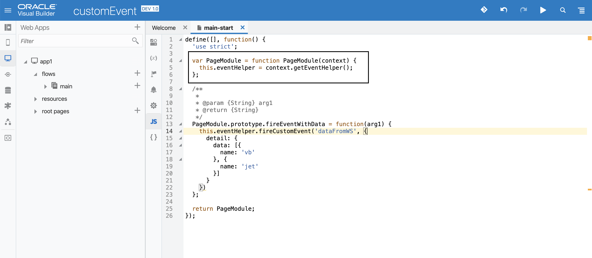
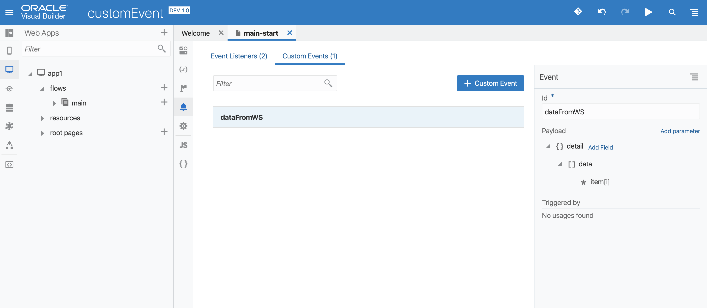
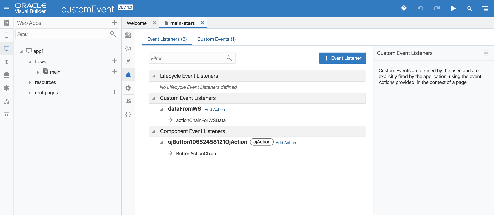

In VBCS you should not assign variables in JS, but some times we need to!. Let’s say you are subscribing to WebSocket data in your JS PageModule and you need to assign that data to a VBCS variable so that you could use it in your application. Or, you have an event listener which you are subscribing in your PageModule and you want to pass down the value to a VBCS variable when the event handler is invoked. In both the cases, you should fire a custom event from your JS, with the data you want to pass (optionally). Lets see how.

## Step 1: Create the eventHelper in your PageModule

When PageModules are created, they are injected with context in their constructor. The context has a utility method called getEventHelper which will give you an instance of EventHelper.

## Step 2: Fire custom event

using the this.eventHelper you can now dispatch custom events from your PageModule. use the this.eventHelper.fireCustomEvent(name, payload) to dispatch it. name must be a unique identifier for the event (will be used later to add action chain listener), payload is optional where you can pass any value (eg. data from WS calls or listener callback data etc).

## Step 3: Declare Custom event on your page

You need to declare the event before adding listeners to it. use the same name that was used while dispatching it from PageModule. Optionally, you can provide payload shape/type as well.

## Step 4: Add a listener to invoke action chain

Final step would be to invoke the action chain and pass the data (if required). Switch to the Event Listeners tab and add a new listener to the newly created custom event. Map the $event with the action chain input if required. The listener should appear under the Custom Event Listeners tab.

## Version
VBCS: 19.3.1