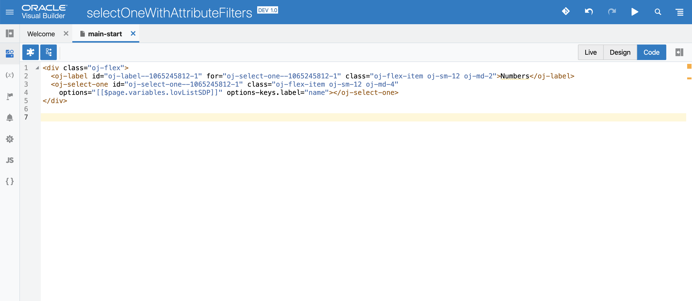
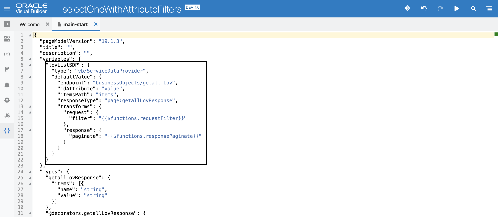
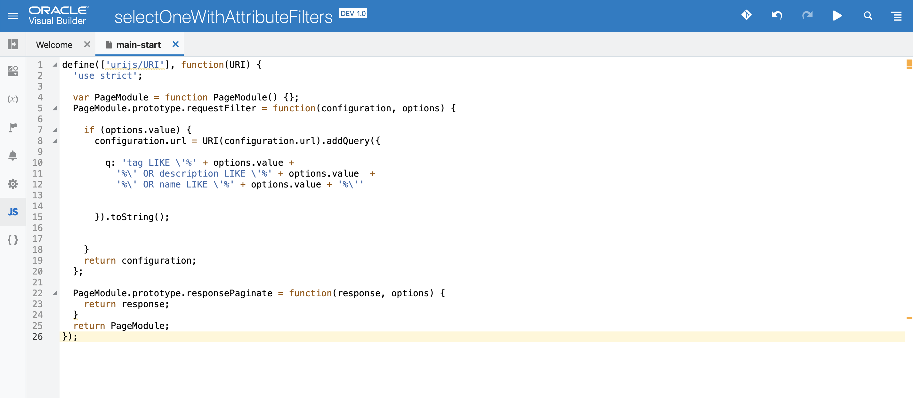

Out of the box, in VBCS the filtering will be enabled for the label attribute specified in options-keys.label for controls like oj-select-one oj-select-many oj-combobox-one oj-combobox-may. What if you want to filter the data based on some other attributes or multiple attributes?

## Using Service Data Provider Transforms

Each of the above controls, when created using from a rest endpoint will have service data provider (SDP) variable created. In this example we will use transform functions to manipulate the auto-generated query which by default uses the aforementioned label attribute.

Select the {} to view the page metadata json where you can locate the lovListSDP variable. Make the below changes to it to enable transforms.

Define the requestFilter and responsePaginate functions in your PageModule, this is where the request and response will be handled.

For the demo, user entered values in the Select One will be queried against the fields: tag, description and name (which is the label)

## Additionally…

Based on your requirement, you can also utilise the other transform functions such as sort, paginate, query, select, body for request transform and body for response transform.

## Version
VBCS: 19.1.3
